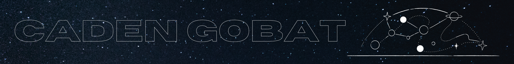

# 

$\mathcal{I}$...

- work in the Space Mission Directorate at [<abbr title="Southwest Research Institute">SwRI</abbr>&ndash;Boulder](https://www.boulder.swri.edu/).
- studied [astrophysics at <abbr title="George Washington University">GWU</abbr>](https://physics.columbian.gwu.edu/astrophysics).
- develop operations software and data pipelines for space science missions, and lead the development of
  - the [<abbr title="Planetary Data System">PDS</abbr>4](https://pds.nasa.gov/datastandards/about/what.shtml) archive data preparation software for the [*Lucy*](https://lucy.swri.edu/) mission.
  - the [<abbr title="Polarimeter to UNify the Corona and Heliosphere">*PUNCH*</abbr>](https://punch.space.swri.edu/) mission operations center's telemetry/[CCSDS](https://public.ccsds.org/about/default.aspx) data processing pipeline.
- do scientific programming, data analysis, and observational astronomy.
- &#x2764; Python and open source software.

Much of the code hosted here on GitHub represents past data analysis work (primarily in Python), using obervational data to investigate physical phenomena. In addition to my current projects at <abbr title="Southwest Research Institute">SwRI</abbr>, I am also interested in instrumentation design and the development of software analysis tools for time-dependent processes. I have done research in a number of labs and academic disciplines, and also worked at a telescope store.

 

<!--
#### Affiliations:
&emsp;
&emsp;
&emsp;
&emsp;

#### Tools/languages I use:

  
-->

## Featured repositories:

 

 

 
My Pinned repositories section below showcases some notable community projects I've contributed to.
  

GitHub Stats 📊

  
  

