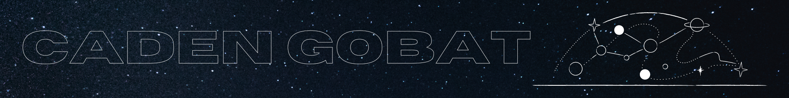

# 

$\mathcal{I}$...

<ul>
  <li>am an Astronomy graduate student at San Diego State University.</li>
  <li>have worked in operations and software development for several active and in-development NASA science missions.</li>
  <!-- <li>do scientific programming, data analysis, and observational astronomy.</li> -->
  <li>dabble in embedded systems, FPGAs, hardware design, and instrumentation development.</li>
  <li>&#x2764; Python, <a href="https://www.gnu.org/philosophy/free-sw.html">free software</a>, and <a href="https://science.nasa.gov/open-science/">open science</a>.</li>
</ul>

---

My Pinned repositories section below showcases some notable projects I've contributed to.
  

GitHub Stats 📊

  

